# Ladder Variational Autoencoders (LVAE)

PyTorch implementation of Ladder Variational Autoencoders (LVAE) [1]:

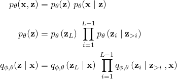

where the variational distributions _q_ at each layer are multivariate Normal
with diagonal covariance.

*Significant differences from [1]* include:
- skip connections in the generative path: conditioning on _all_ layers above
rather than only on _the_ layer above (see for example [2])
- spatial (convolutional) latent variables
- free bits [3] instead of beta annealing [4]

Example to run MNIST:

```
CUDA_VISIBLE_DEVICES=0 python main.py --zdims 32 32 32 32 32 32 32 32 32 32 32 32 --downsample 0 0 1 0 0 1 0 0 0 1 0 0 --nonlin elu --skip --blocks-per-layer 4 --gated --test-batch-size 2000 --freebits 1.0 --tr-log-interv 10000 --ts-log-interv 10000 --ckpt-interv 100000 --ll-interv 50000 --ll-samples 100 --learn-top-prior --data-dep-init --seed 42 --dataset static_mnist
```

(For CelebA, it's necessary to modify the path in `experiment.DatasetLoader`.)


## Likelihood results

Results on standard datasets. Final results on SVHN, CIFAR, and CelebA coming soon.

|  dataset        | num layers | ELBO, 1 iws  | ELBO, 100 iws | ELBO, 1000 iws |
| --------------- |:----------:|:------------:|:-------------:|:--------------:|
| binarized MNIST | 12         | 80.50        | 78.50         | 78.30          |
| binarized MNIST | 6          | 80.74        | 78.65         | 78.52          |
| binarized MNIST | 3          | 82.14        | 79.47         | 79.24          |
| SVHN            | 15         | 4149 (1.95)  | 4103 (1.93)   |                |
| CIFAR10         | 15         | 7236 (3.40)  | 7176  (3.37)  |                |
| CelebA          | 20         | 20873 (2.45) |  20743 (2.44) |                |

Note:
- Bits per dimension in brackets when applicable.
- 'iws' stands for importance weighted samples. More samples means tighter log
  likelihood lower bound. The bound converges to the actual log likelihood as 
  the number of samples goes to infinity [5].
- Each pixel in the images is modeled independently. The likelihood is Bernoulli
  for binary images (MNIST), and discretized mixture of logistics with 10 
  components [6] otherwise.
- Statically binarized MNIST is from Larochelle's website.
- CelebA is rescaled and cropped to 64x64 - see code for details.

## Samples

#### MNIST

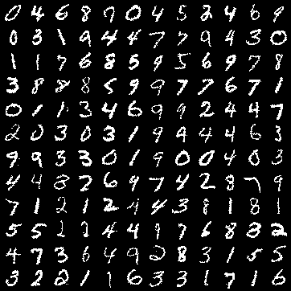

#### SVHN

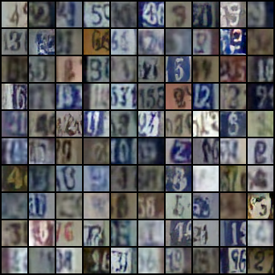

#### CIFAR

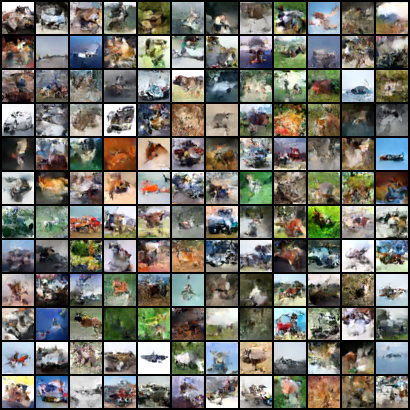

#### CelebA

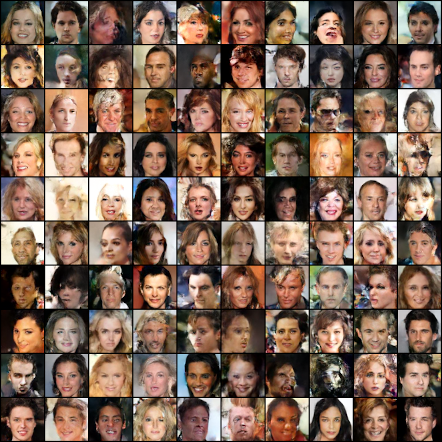


## Hierarchical representations

Here we try to understand the representations learned by individual layers
in some of the datasets.
We can get a rough idea of what's going on at layer _i_ as follows:

- Sample latent variables from all layers above layer _i_ (Eq. 1).

- With these variables fixed, take _S_ conditional samples at layer _i_ (Eq. 2). Note
  that they are all conditioned on the same samples. These correspond to one 
  row in the images below.

- For each of these samples (each small image in the images below), pick the 
  mode/mean of the conditional distribution of each layer below (Eq. 3).
  
- Finally, sample an image ***x*** given the latent variables (Eq. 4).

Formally:

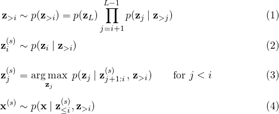

where _s_ = 1, ..., _S_ denotes the sample index.

The equations above yield _S_ sample images conditioned on the same values of 
***z*** for layers _i_+1 to _L_. These _S_ samples are shown in one row of the
images below.
Notice that samples from each row are almost identical when the variability comes
from a low-level layer, as such layers mostly model local structure and details.
Higher layers on the other hand model global structure, and we observe more and
more variability in each row as we move to higher layers. When the sampling 
happens in the top layer (_i = L_), all samples are completely independent, 
even within a row.

#### MNIST: layers 4, 8, 10, and 12 (top)

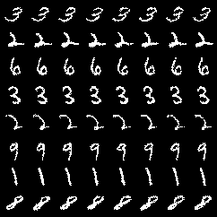&nbsp;&nbsp;
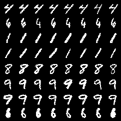

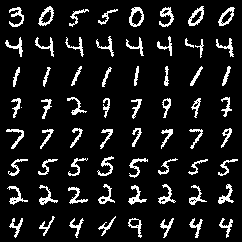&nbsp;&nbsp;
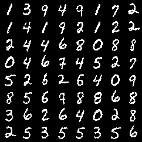


#### SVHN: layers 4, 10, 13, and 15 (top)

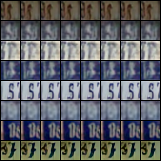&nbsp;&nbsp;
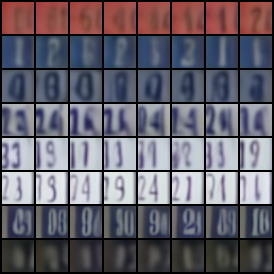

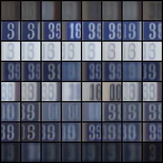&nbsp;&nbsp;
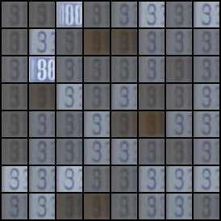


#### CIFAR: layers 3, 7, 10, and 15 (top)

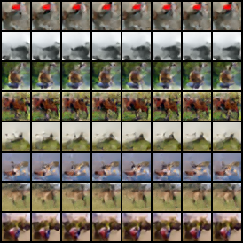&nbsp;&nbsp;
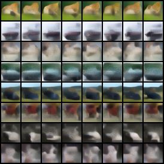

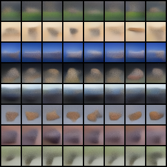&nbsp;&nbsp;
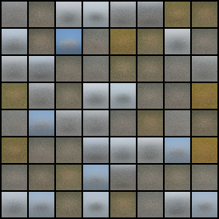


## Experimental details

I did not perform an extensive hyperparameter search, but this worked pretty well:

- Downsampling by a factor of 2 in the beginning of inference.
  After that, activations are downsampled 4 times for 64x64 images (CelebA), and
  3 times otherwise. The spatial size of the final feature map is always 2x2.
  Between these downsampling steps there is approximately the same number of
  stochastic layers.
- 4 residual blocks between stochastic layers. Haven't tried with more
  than 4 though, as models become quite big and we get diminishing returns.
- The deterministic parts of bottom-up and top-down architecture are (almost)
  perfectly mirrored for simplicity.
- Stochastic layers have spatial random variables, and the number of rvs per
  "location" (i.e. number of channels of the feature map after sampling from a
  layer) is 32 in all layers.
- All other feature maps in deterministic paths have 64 channels.
- Skip connections in the generative model (`--skip`).
- Gated residual blocks (`--gated`).
- Learned prior of the top layer (`--learn-top-prior`).
- A form of data-dependent initialization of weights (`--data-dep-init`).
  See code for details.
- freebits=1.0 in experiments with more than 6 stochastic layers, and 0.5 for
  smaller models.
- For everything else, see defaults (`_parse_args()` in `experiment.py`).

With these settings, the number of parameters is roughly 1M per stochastic
  layer. I tried to control for this by experimenting e.g. with half the number
  of layers but twice the number of residual blocks, but it looks like the number
  of stochastic layers is what matters the most.

## References

[1] CK Sønderby,
T Raiko,
L Maaløe,
SK Sønderby,
O Winther.
_Ladder Variational Autoencoders_, NIPS 2016

[2] L Maaløe, M Fraccaro, V Liévin, O Winther.
_BIVA: A Very Deep Hierarchy of Latent Variables for Generative Modeling_,
NeurIPS 2019

[3] DP Kingma,
T Salimans,
R Jozefowicz,
X Chen,
I Sutskever,
M Welling.
_Improved Variational Inference with Inverse Autoregressive Flow_,
NIPS 2016

[4] I Higgins, L Matthey, A Pal, C Burgess, X Glorot, M Botvinick, 
S Mohamed, A Lerchner.
_beta-VAE: Learning Basic Visual Concepts with a Constrained Variational Framework_,
ICLR 2017

[5] Y Burda, RB Grosse, R Salakhutdinov.
_Importance Weighted Autoencoders_,
ICLR 2016

[6] T Salimans, A Karpathy, X Chen, DP Kingma.
_PixelCNN++: Improving the PixelCNN with Discretized Logistic Mixture Likelihood and Other Modifications_,
ICLR 2017
